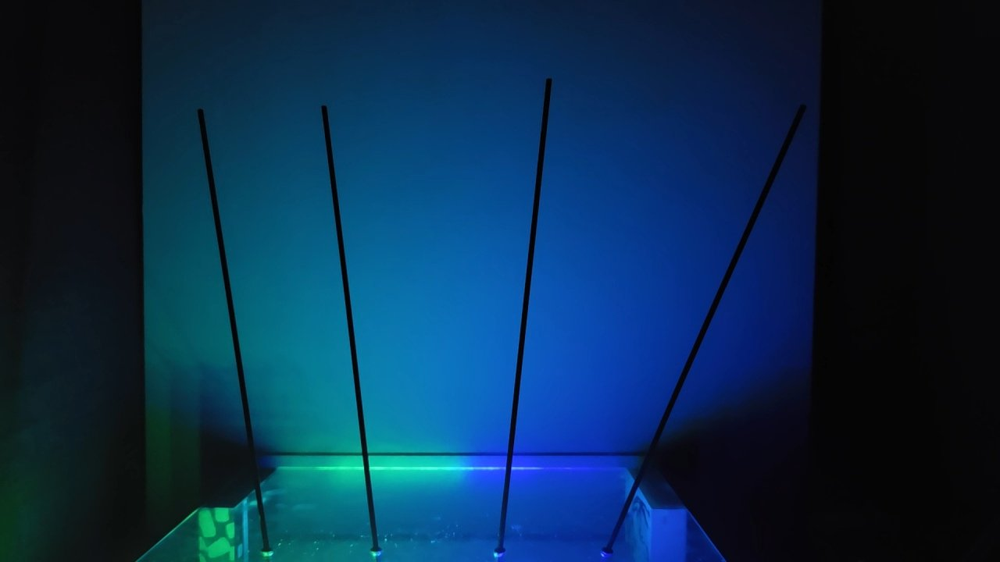

✈️ Airport Flow — A Kinetic Data Sculpture

A physical system that turns live airport activity into motion.

Four rods move continuously — reflecting the flow of people arriving and departing across New York City.

What is normally abstract data becomes something you can watch.

🎥 Demo

[▶ Watch Demos](media/)

💡 Concept

Air travel is constant movement — arrivals, departures, rhythm.

This piece reduces that system to a simple physical language:

- Left → arrivals  
- Right → departures  
- Angle → intensity  

At any moment, the sculpture reflects the state of motion through the city.

🌊 The Idea
Air travel is constant flow.

Arrivals. Departures. Rhythm.

This sculpture turns that flow into something you can see and feel.

First 2 rods → Arrivalse

Second 2 rods → Departures

Motion reflects intensity over time

⚙️ System

Live Flight Data → ESP32 → Servo Driver → Physical Motion

The ESP32 connects to WiFi and pulls live data

Data is compressed into simple ranges

Each rod represents a slice of activity

Motion is intentionally minimal — subtle tilt over time

🧩 Build

Electronics

--ESP32 (WiFi-enabled microcontroller)

--PCA9685 (16-channel servo driver)

--SG90 micro servos

Mechanical

--Carbon fiber rods (3mm)

--Steel pushrods + linkage

--Plexiglass top plate

Power

--5V 5A external supply

Lighting

--WS2812B LED strip (addressable)

📊 Data

Source: AeroDataBox API (RapidAPI)

Data sampled in short time windows

Normalized → mapped to servo angles

🎯 Design Choices

Tilt over lift → more stable, more readable

Linear layout → clear left/right meaning

Low amplitude motion → avoids noise, feels intentional

Minimal abstraction → data → motion, directly

🔮 Next Iteration

Precision linkage (ball joints / bearings)

Motion interpolation (more fluid transitions)

Enclosed structure / mounting system

Higher resolution data mapping

Fully autonomous data pipeline

❤️ Why This Exists

An experiment in:  Physical computing, Motion as data, Real-time systems, Learning by building, 

🧠 Note

This project was designed and built rapidly as a proof of concept — prioritizing exploration, iteration, and execution over perfection.
